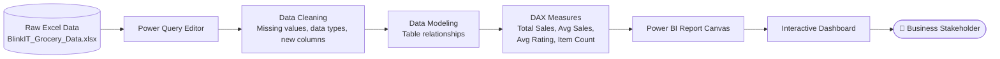
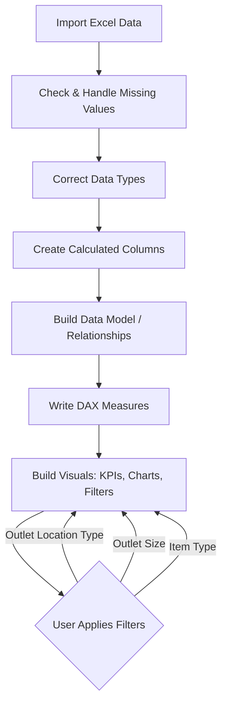

# 🛒 Blinkit Data Analysis — Power BI Dashboard

An end-to-end business intelligence project analyzing Blinkit (India's quick-commerce grocery delivery platform) sales, outlet performance, and customer satisfaction data — built entirely in **Power BI**, from raw data cleaning to an interactive executive dashboard.


---

## 📌 Business Problem

Blinkit operates thousands of outlets varying in size, location tier, and format (grocery store vs. supermarket). Leadership needs a single view to answer:

- Which outlet types and location tiers drive the most sales?
- Does product fat content or item type correlate with sales performance?
- How is customer satisfaction (ratings) distributed across outlets?
- How has outlet growth trended over the years?

This dashboard consolidates 8,500+ transaction-level records into an interactive report that answers these questions in seconds instead of manual spreadsheet digging.

---

## 📊 Key Performance Indicators (KPIs)

| KPI              | Value    |
|------------------|----------|
| Total Sales      | **$1.20M** |
| Average Sales     | **$141**   |
| Average Rating    | **3.9 / 5** |
| Number of Items   | **8,523**  |

---

## 🗂️ Dataset Overview

Source file: `data/BlinkIT_Grocery_Data.xlsx` — 8,523 item-level records across 12 fields.

| Column                     | Description                                          |
|----------------------------|-------------------------------------------------------|
| `Item Identifier`          | Unique product ID                                     |
| `Item Fat Content`         | Low Fat / Regular                                     |
| `Item Type`                | Product category (Fruits & Vegetables, Snacks, etc.) |
| `Item Weight`               | Product weight                                        |
| `Item Visibility`          | Shelf visibility percentage                           |
| `Sales`                    | Revenue generated by the item                         |
| `Rating`                   | Customer rating for the outlet/item                   |
| `Outlet Identifier`        | Unique outlet ID                                       |
| `Outlet Establishment Year`| Year the outlet was opened                             |
| `Outlet Size`               | Small / Medium / High                                  |
| `Outlet Location Type`     | Tier 1 / Tier 2 / Tier 3                               |
| `Outlet Type`               | Grocery Store / Supermarket Type1 / Type2 / Type3      |

---

## 🏗️ Architecture — Data Flow Diagram (DFD)



### Processing Pipeline



---

## 🧮 Sample DAX Measures

```dax
Total Sales = SUM('BlinkIT Grocery Data'[Sales])

Average Sales = AVERAGE('BlinkIT Grocery Data'[Sales])

Average Rating = AVERAGE('BlinkIT Grocery Data'[Rating])

Number of Items = COUNTROWS('BlinkIT Grocery Data')
```

These four measures power the top-level KPI cards on the dashboard and dynamically recalculate as slicers (Outlet Location Type, Outlet Size, Item Type) are applied.

---

## 🗃️ SQL Analysis (`sql/blinkit_analysis.sql`)

To demonstrate the same insights through pure SQL (in addition to DAX/Power BI), the dataset is also modeled as a relational table with a full analysis script covering:

- Table schema (`CREATE TABLE blinkit_sales`)
- KPI queries — Total Sales, Average Sales, Average Rating, Item Count
- Fat Content analysis (overall + by outlet tier)
- Item Type-wise sales ranking
- Outlet Size & Outlet Location Tier breakdowns
- Outlet Establishment year trend
- Outlet Type comparison table (mirrors the dashboard table)
- **Window function** — Top 5 best-selling item types per outlet tier (`RANK() OVER PARTITION BY`)
- **Correlated subquery** — outlets with above-average rating but below-average sales (actionable business insight)

```sql
-- Example: Outlet Type performance summary
SELECT
    outlet_type,
    ROUND(SUM(sales), 2)          AS total_sales,
    COUNT(*)                      AS number_of_items,
    ROUND(AVG(sales), 2)          AS avg_sales,
    ROUND(AVG(rating), 1)         AS avg_rating
FROM blinkit_sales
GROUP BY outlet_type
ORDER BY total_sales DESC;
```

See the full script at [`sql/blinkit_analysis.sql`](sql/blinkit_analysis.sql).

---

## 📈 Dashboard Preview

### Executive Overview


### Sales Breakdown


### Ratings Analysis


---

## 📊 Visuals Included

- **KPI Cards** — Total Sales, Average Sales, Average Rating, Number of Items
- **Fat Content Analysis** — Low Fat vs Regular sales split
- **Item Type-wise Sales** — Fruits, Snacks, Household, etc.
- **Outlet Size Distribution** — Small / Medium / High
- **Outlet Location Analysis** — Tier 1 / Tier 2 / Tier 3
- **Outlet Establishment Trend** — Line chart of outlet growth over the years
- **Outlet Type Comparison Table** — Total Sales, Item Count, Avg Sales, Rating, Item Visibility across Grocery Store vs. Supermarket types
- **Interactive Filter Panel** — Slice by Outlet Location Type, Outlet Size, and Item Type

---

## 🔍 Key Insights

- **Tier 3 outlets** and **Supermarket Type1** stores contribute the highest share of total sales.
- **Regular fat-content** products slightly outperform **Low Fat** products in overall sales.
- Outlet establishment shows a clear multi-year growth trend, useful for expansion planning.
- Sales and item visibility vary meaningfully across outlet types — informing restocking and merchandising priorities.

---

## 🛠️ Tools & Skills Demonstrated

| Skill                    | Applied Via                                             |
|---------------------------|----------------------------------------------------------|
| Data Cleaning              | Power Query (missing values, type correction)            |
| Data Modeling              | Table relationships in Power BI                           |
| DAX                        | Custom measures for KPIs                                  |
| Data Visualization         | Bar, line, donut charts, KPI cards, cross-filtering       |
| Dashboard Design           | Layout, interactivity, slicers/filters                    |
| Business Analysis          | Translating raw data into actionable retail insights      |

---

## 📂 Project Structure

```
blinkit-powerbi-dashboard/
├── data/
│   └── BlinkIT_Grocery_Data.xlsx      # Raw source dataset (8,523 records)
├── sql/
│   └── blinkit_analysis.sql            # Schema + full analysis queries
├── screenshots/
│   ├── dashboard_overview.png
│   ├── sales_analysis.png
│   └── rating_analysis.png
└── README.md
```

> **Note:** The `.pbix` Power BI report file itself isn't included in this upload — only the source data and exported screenshots. Add your `.pbix` file to the repo root before publishing so recruiters/visitors can open and interact with the live report in Power BI Desktop.

---

## ⚙️ How to Explore This Project

1. Clone the repository.
2. Open `data/BlinkIT_Grocery_Data.xlsx` to inspect the raw dataset.
3. If you add the `.pbix` file: open it in **Power BI Desktop** (free download from Microsoft) to interact with live filters and drill-downs.
4. Otherwise, refer to the `screenshots/` folder for static views of each dashboard page.

---

## 🚀 Future Improvements

- [ ] Add the `.pbix` file to the repository for full interactivity
- [ ] Publish the report to Power BI Service and embed a live web link
- [ ] Add year-over-year sales growth measures using DAX time intelligence
- [ ] Incorporate a forecasting visual for future sales trends

---

## 👤 Author

**Aman Kumar**
- GitHub: [@Aman1-23](https://github.com/Aman1-23)
- LinkedIn: [aman-kumar-96a28a372](https://linkedin.com/in/aman-kumar-96a28a372)
- LeetCode: [Aman8886](https://leetcode.com/u/Aman8886/)
- Email: amank273054@gmail.com

---

## 📄 License

This project is open-sourced for educational and portfolio purposes.
